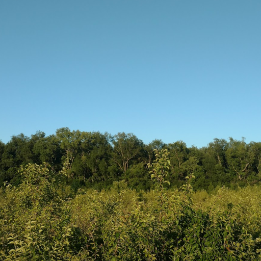
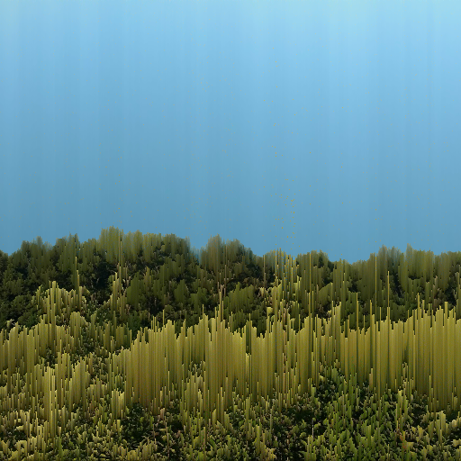
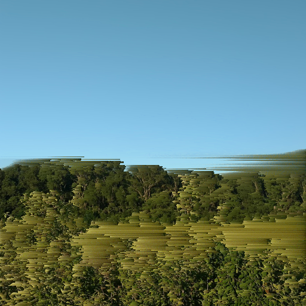
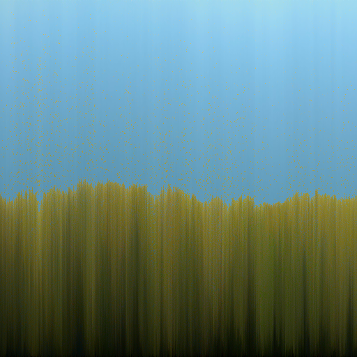

pixelsort
=========

A custom GEGL operation (and by extension GIMP filter) that implements a pixel
sorting effect.  To use it click "Tools->GEGL Operation" and choose "Pixel Sort"
in the dropdown.

This is primarily a port of the following processing script to a GEGL operation:
https://github.com/kimasendorf/ASDFPixelSort

## Compiling and Installing

### Linux

To compile and install you will need the GEGL header files (`libgegl-dev` on
Debian based distributions or `gegl` on Arch Linux) and meson (`meson` on
most distributions).

```bash
meson setup build
ninja -C build
cp build/pixelsort.so ~/.local/share/gegl-0.4/plug-ins
```

If you have an older version of gegl you may need to copy to `~/.local/share/gegl-0.3/plug-ins`
instead (on Ubuntu 18.04 for example).

### Windows

I have not figured out how to build and install this on Windows yet, hopefully there will
be some instructions here in the near future.

## Example Images

Original image:



Vertical sorting with luminance as the mode:



Horizontal sorting with white level as the mode:



Complete vertical sorting by luminance (threshold of 0):


